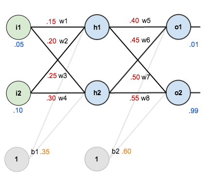
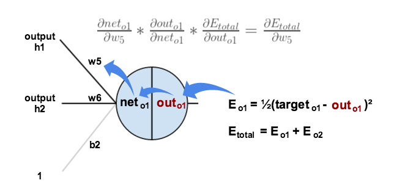

# A Step by Step Backpropagation Example

# 一步一步实例理解反向传播

> ##### 译序
>
> 由于人工智能在近年取得的巨大成功，在我的工作中需要涉及机器学习，以及人工智能的项目和产品需求越来越多。而合作的同事们未必都有很好的数学和计算机基础，为了未来工作中更好地沟通，我找来了这篇非常好的文章，它以一个简单真实的反馈神经网络的解算过程，帮助大家理解机器学习的基本原理与方法。
>
> 本来原文的英语就非常简洁，逻辑清晰，语义上并无翻译的必要。译文的意义在于记录我自己的一些体会，以及提示一些计算机与应用数学方面的概念和技巧，以便其他专业的朋友易于理解。译文也对原文进行了一些数学表述上的修改或说明，以便大家更容易地去除理解上的混乱。
>
> 本译文是作为一个开源项目发布在 [GitHub](https://github.com/vortune/actual-number-backpropagation) 上的。你可以通过下面的命令来克隆这个项目：
>
> ```shell
> $ git clone https://github.com/vortune/actual-number-backpropagation.git
> ```
>
> 上面的源码库里面有 markdown 格式的本文文件以及英文原文源码，扩展名是 .md 。
> > 建议大家使用 [Typora](https://typora.io/) 来查看与编辑 markdown 文件，同时也可以用它来将文档渲染成为其他格式，譬如，pdf, html, word 等等。
>
> 原著：[Matthew.H.Mazur](matthew.h.mazur@gmail.com)
>
> 编译：[罗峥嵘](vortune@163.com)

Backpropagation is a common method for training a neural network. There is [no shortage of papers](https://www.google.com/search?q=backpropagation+algorithm) online that attempt to explain how backpropagation works, but few that include an example with actual numbers. This post is my attempt to explain how it works with a concrete example that folks can compare their own calculations to in order to ensure they understand backpropagation correctly.

反向传播是训练神经网络的一种常用的方法。网上并不缺乏说明反向传播的工作机制的文章，只是它们都缺乏包含实际数值计算的例子。我的这个帖子就是希望以具体的范例，让大家可以从实际的计算中，正确理解反向传播算法。

If this kind of thing interests you, you should [sign up for my newsletter](http://www.emergentmind.com/newsletter) where I post about AI-related projects that I’m working on.

如果你对这些有兴趣，你可以登录[我的新闻组](http://www.emergentmind.com/newsletter)，那里有我发布的一些我正在做的人工智能相关的项目。

## Backpropagation in Python

## Python 语言实现的反向传播

You can play around with a Python script that I wrote that implements the backpropagation algorithm in [this Github repo](https://github.com/mattm/simple-neural-network).

你可以通过一个我在[Github 源码库](https://github.com/mattm/simple-neural-network)中的一个 Python 脚本程序来体会反向传播算法。

## Backpropagation Visualization

## 可视化的反向传播

For an interactive visualization showing a neural network as it learns, check out my [Neural Network visualization](http://www.emergentmind.com/neural-network).

你要互动形象地体会一下神经网络学习过程的话，请查看我的[神经网络视图](http://www.emergentmind.com/neural-network) 。

## Additional Resources

## 额外的资料

If you find this tutorial useful and want to continue learning about neural networks and their applications, I highly recommend checking out Adrian Rosebrock’s excellent tutorial on [Getting Started with Deep Learning and Python](http://www.pyimagesearch.com/2014/09/22/getting-started-deep-learning-python).

如果你发现这个教程有用，并且希望继续学习神经网络以及它们的应用，我强烈建议你查看 Adrian Rosebrock 的非常了不起的教程[深度学习与 Python 入门](http://www.pyimagesearch.com/2014/09/22/getting-started-deep-learning-python) 。

## Overview

## 概述

For this tutorial, we’re going to use a neural network with two inputs, two hidden neurons, two output neurons. Additionally, the hidden and output neurons will include a bias.

在这一教程中，我们将使用一个简单的神经网络，它包含两个输入，两个隐藏神经元，两个输出神经元。另外，隐藏和输出神经元都各自包含一个偏至量（$b1$，$b2$）。

Here’s the basic structure:

下面就是这个基本结构：

<center>

</center>

In order to have some numbers to work with, here are the **initial weights**, the **biases**, and **training inputs/outputs**:

为了展开实际的数值计算工作，这里需要初始化**权重**，**偏至**，以及用于训练的**输入**/**输出**的初始值：
<center>

</center>
The goal of backpropagation is to optimize the weights so that the neural network can learn how to correctly map arbitrary inputs to outputs.

反向传播算法的目的，就是优化神经元的链接权重，以便神经网络能够形成一个从输入变换到输出的映射关系。

For the rest of this tutorial we’re going to work with a single training set: given inputs 0.05 and 0.10, we want the neural network to output 0.01 and 0.99.

在本教程的余下部分中，我们将通过一个训练集来工作：给定的输入为 0.05 与 0.10，我们希望神经网络输出 0.01 与 0.99。

## The Forward Pass

## 前向传播

To begin, lets see what the neural network currently predicts given the weights and biases above and inputs of 0.05 and 0.10. To do this we’ll feed those inputs forward though the network.

让我们看看在一开始时，神经网络在前面所设定的权重量与偏至量下，在输入量为 0.05 与 0.10 时，它会输出什么。为此，我们将输入量向前传递，历遍整个网络。

We figure out the *total net input* to each hidden layer neuron, *squash* the total net input using an *activation function* (here we use the *logistic function*), then repeat the process with the output layer neurons.

我们需要计算每个隐藏层神经元接收的`总网络输入`，并且以`激活函数`将总网络输入压出（这里我们使用 `logistic 函数`），然后对输出层神经元重复同样的步骤。

> Total net input is also referred to as just net input by [some sources](http://web.cs.swarthmore.edu/~meeden/cs81/s10/BackPropDeriv.pdf).
>
> 有一些[资料](http://web.cs.swarthmore.edu/~meeden/cs81/s10/BackPropDeriv.pdf)又将总网络输入称为网络输入。

Here’s how we calculate the total net input for $h_1$ :

这里我们计算隐藏层第一个神经元 $h_1$ 所接收的总输入：
$$
\begin{align}
net_{h1}  &=  w_1 \cdot i_1 + w_2 \cdot i_2 + b_1 \cdot 1 \\ \\
&= 0.15 * 0.05 + 0.2 * 0.1 + 0.35 * 1 \\ \\
&= 0.3775
\end{align}
$$

We then squash it using the logistic function to get the output of $h_1$ :

接着我们以 logistic 函数将它压出作为神经元 $h_1$ 的输出：
$$
\begin{align}
out_{h1} &= \frac{1}{1+e^{-net_{h1}}} \\ \\
&= \frac{1}{1+e^{-0.3775}} \\ \\
&= 0.593269992
\end{align}
$$

> ##### 译注：
>
> 选择 logistic 函数作为激活函数是有原因的。它的形式如下：
> $$
> f(x) = \frac{1}{1+e^{-x}}
> $$
>
> 首先他是一个 S 型函数，它的值范围是 0～1（ $f(x) \in \left[0,1\right]$ ），它的跳变特性有利于该神经元对数据特征的表达。它的图形如下：
>
> <center>
> 
> </center>
>
> 此外，它的一个特征是它的微分形式非常简洁，对计算十分有利，我们很快就可以在下文中看到它的这一优势特性。
>
> 事实上，并不是所有神经网络都采用 logistic 函数作为激活函数的。随着机器学习的快速发展，目前在各种各样不同功能特性的神经网络中，也有采用其他的函数作为激活函数的。最典型的做法是在深度学习网络中，加入一些特定的层，以及特定的激活函数，从而达到强化网络的某种特定功能或者优化性能的目的。

Carrying out the same process for $h_2$ we get:

同样的步骤，我们就能得到 $h_2$ 的输出：
$$
out_{h2} = 0.596884378
$$

We repeat this process for the output layer neurons, using the output from the hidden layer neurons as inputs.

我们将隐藏层的输出当作输出层的输入，就可以对输出层做同样的计算。

Here’s the output for $o_1$:

下面是输出层第一个神经元 $o_1$ 的输出量：
$$
\begin{align}
net_{o1} &= w_5 \cdot out_{h1} + w_6 \cdot out_{h2} + b_2 \cdot 1 \\ \\
&= 0.4 * 0.593269992 + 0.45 * 0.596884378 + 0.6 * 1 \\ \\
&= 1.105905967 \\ \\
out_{o1} &= \frac{1}{1+e^{-net_{o1}}} \\ \\
&= \frac{1}{1+e^{-1.1059059067}} \\ \\
&= 0.75136507
\end{align}
$$

And carrying out the same process for $o_2$ we get:

并且以同样的步骤得到输出层第二个神经元 $o_2$ 的输出量：
$$
out_{o2} = 0.772928465
$$

### Calculating the Total Error

### 计算总误差

We can now calculate the error for each output neuron using the [squared error function](http://en.wikipedia.org/wiki/Backpropagation#Derivation) and sum them to get the total error:

现在我们可以用[平方差函数](http://en.wikipedia.org/wiki/Backpropagation#Derivation)来计算输出层每个神经元的误差，并且将它们相加来得到总误差。
$$
E_{total} = \sum \frac{1}{2}\|target - output\|^2
$$

>##### 译注：
>
>误差计算的函数在机器学习中被称为`代价函数`（Cost Function），也被翻译为`成本函数`。与激活函数一样，代价函数也可以有多种形式，并不限于平方差函数。

> [Some sources](http://www.amazon.com/Introduction-Math-Neural-Networks-Heaton-ebook/dp/B00845UQL6/ref=sr_1_1?ie=UTF8&qid=1426296804&sr=8-1&keywords=neural+network) refer to the target as the *ideal* and the output as the *actual*.
>
> [有些资料](http://www.amazon.com/Introduction-Math-Neural-Networks-Heaton-ebook/dp/B00845UQL6/ref=sr_1_1?ie=UTF8&qid=1426296804&sr=8-1&keywords=neural+network)将目标称为*期望*，将输出称为*现实*。

> The $\frac{1}{2}$ is included so that exponent is cancelled when we differentiate later on. The result is eventually multiplied by a learning rate anyway so it doesn’t matter that we introduce a constant here [[1](http://en.wikipedia.org/wiki/Backpropagation#Derivation)].
>
> 这里包含的 $\frac{1}{2}$ 这个系数是为了在后面的微分运算的结果中约掉它。这里的计算结果，最终都将用于与学习速率相乘，所以不必在意这里引入一个常数。
>
> > 译注：统一引入一个全局的常数系数，并不会影响对整个网络计算结果的判断。但是在计算中约掉一个乘法项，对算法的工程性能有很大的提高。在计算工程实现中，这样的技巧比比皆是。


For example, the target output for $o_1$ is 0.01 but the neural network output 0.75136507, therefore its error is:

以输出层第一个神经元 $o_1$ 为例，它的目标输出为 0.01，但是网络输出却是 0.75136507，所以它的误差如下：
$$
\begin{align}
E_{o1} &= \frac{1}{2}\|target_{o1}-out_{o1}\|^2 \\ \\
&=\frac{1}{2}\|0.01-0.75136507\|^2 \\ \\
&= 0.274811083
\end{align}
$$

Repeating this process for $o_2$ (remembering that the target is 0.99) we get:

重复上述步骤得到 $o_2$ 的输出量（记得它的目标值是 0.99）：
$$
E_{o2} = 0.023560026
$$

The total error for the neural network is the sum of these errors:

网络的总误差就是这些误差之和：
$$
\begin{align}
E_{total} &= E_{o1} + E_{o2} \\ \\
&= 0.274811083 + 0.023560026 \\ \\
&= 0.298371109
\end{align}
$$

## The Backwards Pass

## 向后传播

Our goal with backpropagation is to update each of the weights in the network so that they cause the actual output to be closer the target output, thereby minimizing the error for each output neuron and the network as a whole.

我们的目标是通过向后传播算法，更新网络中的每个链接权重，从而使得实际的输出尽量接近目标输出，亦即最小化每个输出层神经元的输出误差与网络的整体误差。

### Output Layer

### 输出层

Consider $w_5$. We want to know how much a change in $w_5$ affects the total error, aka $\frac{\partial E_{total}}{\partial w_5}$.

考虑 $w_5$ 。我们需要知道 $w_5$ 的改变会对总误差产生多大的影响，也就是 $\frac{\partial E_{total}}{\partial w_5}$ 。

>$\frac{\partial E_{total}}{\partial w_5}$ is read as “the partial derivative of  $E_{total}$ with respect to $w_5$“. You can also say “the gradient with respect to $w_5$“.
>
>$\frac{\partial E_{total}}{\partial w_5}$ 视为“$E_{total}$ 对于 $w_5$ 的偏微分”。你也可以称之为“对 $w_5$ 的关联梯度”。

By applying the [chain rule](http://en.wikipedia.org/wiki/Chain_rule) we know that:

通过应用[链式规则](http://en.wikipedia.org/wiki/Chain_rule)，我们可知：
$$
\frac{\partial E_{total}}{\partial w_5} =
\frac{\partial E_{total}}{\partial out_{o1}} \cdot 
\frac{\partial out_{o1}}{\partial net_{o1}} \cdot
\frac{\partial net_{o1}}{\partial w_5}
$$

>##### 译注：
>**链式规则是反向传播算法的核心思想！**它可以让我们非常容易地求解每个链接权重（weight）对网络总输出误差的影响，亦即每个权重项对总误差的偏微分。

Visually, here’s what we’re doing:

形象地描绘一下我们要做的事情：

<center>

</center>

We need to figure out each piece in this equation.

我们需要计算出等式中的每个单项。

First, how much does the total error change with respect to the output?

首先是每个输出项对于总体误差的相关性影响有多大？
$$
E_{total} = \frac{1}{2}\|target_{o1}-out_{o1}\|^2 
+ \frac{1}{2}\|target_{o2}-out_{o2}\|^2
$$
> 译注：对上面的等式两边取 $out_{o1}$ 的偏微分：

$$
\begin{align}
\frac {\partial E_{total}}{\partial out_{o1}} &=
2 \cdot \frac {1}{2}\|target_{o1}-out_{o1}\|^{2-1} + 0 \\ \\
&= \|target_{o1}-out_{o1}\| \\ \\
&= \|0.01-0.75136507\| \\ \\
&= 0.74136507
\end{align}
$$

> When we take the partial derivative of the total error with respect to $out_{o1}$, the quantity $\frac{1}{2}\|target_{o2} - out_{o2}\|^{2}$ becomes zero because $out_{o1}$ does not affect it which means we’re taking the derivative of a constant which is zero.
>
> 当我们对总体误差取关于 $out_{o1}$ 的偏微分时，总体误差的第二项 $\frac{1}{2} \|target_{o2} - out_{o2}\|^2$ 将等于0，因为 $out_{o1}$ 的变化对于该项并无影响，其意义就如我们所说的，一个常数的导数总是等于0。

Next, how much does the output of $o_1$ change with respect to its total net input ?

接着，就是输出层第一个神经元 $o_1$ 的输出变化，会受该节点的网络总输入的影响有多大呢？

The [derivative of the logistic function](http://en.wikipedia.org/wiki/Logistic_function#Derivative) is the output multiplied by 1 minus the output:

[Logistic 函数的导数](http://en.wikipedia.org/wiki/Logistic_function#Derivative)就是函数的返回值再乘以1减函数的返回值：
$$
out_{o1} = \frac {1}{1+e^{-net_{o1}}}
$$
>译注：这里是对神经元内部的激活函数两边取微分。从严格的数学概念来说，这里应该是一个`常微分方程`：
$$
\begin{align}
\frac {\partial out_{o1}}{\partial net_{o1}} 
&= out_{o1}(1-out_{o1}) \\ \\
&= 0.75136507(1-0.75136507) \\ \\
&= 0.186815602
\end{align}
$$

> ##### 译注：
>
> 从这里我们可以看到为什么选取 logistic 函数作为激活函数的原因。它的导数非常简单，现在的机器学习的神经网络规模往往非常大。简化其中任何一个算法步骤，不但能极大地提高算法性能，同时也优化了计算的误差。

Finally, how much does the total net input of $o1$ change with respect to $w_5$?

最后是输出层神经元 $o_1$ 它的网络总输入的变化受权重项 $w_5$ 的影响强度 ？
$$
net_{o1} = w_5 \cdot out_{h1} + w_6 \cdot out_{h2} + b_2 \cdot 1
$$
>译注：对项目的等式两边取 $w_5$ 的偏导数：
$$
\begin{align}
\frac {\partial net_{o1}}{\partial w_5} &=
1 \cdot out_{h1} \cdot w_5^{(1-1)} + 0 + 0 \\ \\
&= out_{h1} \\ \\
&= 0.593269992
\end{align}
$$

Putting it all together:

将它们代入到一起计算：
$$
\begin{align}
\frac {\partial E_{total}}{\partial w5} &= 
\frac {\partial E_{total}}{\partial out_{h1}} \cdot
\frac {\partial out_{h1}}{\partial net_{h1}} \cdot
\frac {\partial net_{h1}}{\partial w_5} \\ \\
&= 0.74136507 * 0.186815602 * 0.593269992 \\ \\
&= 0.082167041
\end{align}
$$

> You’ll often see this calculation combined in the form of the [delta rule](http://en.wikipedia.org/wiki/Delta_rule):
>
> 你经常会看到计算的过程会以[delta规则](http://en.wikipedia.org/wiki/Delta_rule)的形式合并在一起：
> $$
> \frac {\partial E_{total}}{\partial w_5} =
> -(target_{o1}-out_{o1}) \cdot out_{o1}(1-out_{o1}) \cdot out_{h1}
> $$
>
> Alternatively, we have $\frac{\partial E_{total}}{\partial out_{o1}}$ and $\frac{\partial out_{o1}}{\partial net_{o1}}$ which can be written as $\frac{\partial E_{total}}{\partial net_{o1}}$, aka $\delta_{o1}$ (the Greek letter delta) aka the *node delta*. We can use this to rewrite the calculation above:
>
> 换言之，我们可以将 $\frac{\partial E_{total}}{\partial out_{o1}}$ 与 $\frac{\partial out_{o1}}{\partial net_{o1}}$ 合并写成 $\frac{\partial E_{total}}{\partial net_{o1}}$，也称其为 $\delta_{o1}$ 或`节点差模`。我可以用它来重写上面的算式：
>
>
> $$
> \begin{align}
> \delta_{o1} &= \frac{\partial E_{total}}{\partial out_{o1}} \cdot
> \frac{\partial out_{o1}}{\partial net_{o1}} \\ \\
> &= \frac{\partial E_{total}}{\partial net_{o1}} \\ \\
> &= -(target_{o1}-out_{o1}) \cdot out_{o1}(1-out_{o1})
> \end{align}
> $$
>
> Therefore:
>
> 由上式可得：
> $$
> \frac{\partial E_{total}}{\partial w_5} = \delta_{o1} \cdot out_{h1}
> $$
>
> Some sources extract the negative sign from $\delta$ so it would be written as:
>
> 有些资料将 $\delta$ 的负号展开写成：
> $$
> \frac{\partial E_{total}}{\partial w_5} = -\delta_{o1} \cdot out_{h1}
> $$
>

To decrease the error, we then subtract this value from the current weight (optionally multiplied by some learning rate, eta, which we'll set to 0.5):

为了降低误差，我们从当前的权重值中减掉这个节点差模量（可以乘以一个我们自选的学习速率 eta，这里我们设定为 0.5）：
$$
\begin{align}
w_5^+ &= w_5 - \eta \frac{\partial E_{total}}{\partial w_5} \\ \\
&= 0.4 - 0.5 * 0.082167041 \\ \\
&= 0.35891648
\end{align}
$$
>##### 译注：
>
>我们需要牢记的就是反向传播算法的核心思想，就是求解网络中每个链接权重对整体误差的影响，然后以一个学习步长量来不断更新各个权重量，以此降低其对总体误差的影响。

[Some](http://en.wikipedia.org/wiki/Delta_rule) [sources](http://aima.cs.berkeley.edu/) use $\alpha$ (alpha) to represent the learning rate, [others use](https://www4.rgu.ac.uk/files/chapter3%20-%20bp.pdf) $\eta$ (eta), and [others](http://web.cs.swarthmore.edu/~meeden/cs81/s10/BackPropDeriv.pdf) even use $\epsilon$  (epsilon).

[有些资料](http://aima.cs.berkeley.edu/)用 $\alpha$ (alpha) 来表示学习速率，[另外一些](https://www4.rgu.ac.uk/files/chapter3%20-%20bp.pdf)用 $\eta$ (eta)，还有[其他的](http://web.cs.swarthmore.edu/~meeden/cs81/s10/BackPropDeriv.pdf)用 $\epsilon$ (epsilon) 。

We can repeat this process to get the new weights $w_6$, $w_7$, and $w_8$:

我们重复上面的步骤，就可以得到新的输出层中的其他链接权重 $w_6$， $w_7$，与 $w_8$ ：
$$
\begin{align}
w_6^{+} &= 0.408666186 \\ \\
w_7^{+} &= 0.511301270 \\ \\
w_8^{+} &= 0.561370121
\end{align}
$$

We perform the actual updates in the neural network after we have the new weights leading into the hidden layer neurons (ie, we use the original weights, not the updated weights, when we continue the backpropagation algorithm below).

当我们以类似于处理输出层的方法那样，也导出了新的隐藏层的各个神经元的链接权重之后，我们会在神经网络中执行新的运算（现在还不是时候，在接下来的反向传播算法的推算当中，我们仍然需要使用原来的权重值，而不是更新过的权重值）。

### Hidden Layer

### 隐藏层

Next, we’ll continue the backwards pass by calculating new values for $w_1$, $w_2$, $w_3$, and $w_4$.

下一步，我们将通过给 $w_1$，$w_2$，$w_3$，与 $w_4$ 重新赋值来继续进行反向传播。

Big picture, here’s what we need to figure out:

放眼全程地看，这里我们解算：
$$
\frac{\partial E_{total}}{\partial w_1} = \frac{\partial E_{total}}{\partial out_{h1}} \cdot
\frac{\partial out_{h1}}{\partial net_{h1}} \cdot
\frac{\partial net_{h1}}{\partial w_1}
$$

Visually:

形象地看：

<center>

</center>

We’re going to use a similar process as we did for the output layer, but slightly different to account for the fact that the output of each hidden layer neuron contributes to the output (and therefore error) of multiple output neurons. We know that $out_{h1}$ affects both $out_{o1}$ and $out_{o2}$ therefore the $\frac{\partial E_{total}}{\partial out_{h1}}$ needs to take into consideration its effect on the both output neurons:

我们将进行一个类似的步骤，就像我们在输出层中做过的那样，不过稍微不同的是，每个隐藏层神经元的输出（以及由此而来的误差）都会被传递到多个输出层的神经元中。我们知道 $out_{h1}$ 会影响到 $out_{o1}$ 与 $out_{o2}$，所以需要考虑 $\frac{\partial E_{total}}{\partial out_{h1}}$ 对两个输出层神经元的影响：


$$
\frac{\partial E_{total}}{\partial out_{h1}} = 
\frac{\partial E_{o1}}{\partial out_{h1}} + \frac{\partial E_{o2}}{\partial out_{h1}}
$$

Starting with $\frac{\partial E_{o1}}{\partial out_{h1}}$:

先从 $\frac{\partial E_{o1}}{\partial out_{h1}}$ 开始：
$$
\frac{\partial E_{o1}}{\partial out_{h1}} =
\frac{\partial E_{o1}}{\partial net_{o1}} \cdot \frac{\partial net_{o1}}{\partial out_{h1}}
$$

We can calculate $\frac{\partial E_{o1}}{\partial net_{o1}}$ using values we calculated earlier:

我们可以利用前面的计算结果来计算 $\frac{\partial E_{o1}}{\partial net_{o1}}$ ：
$$
\begin{align}
\frac{\partial E_{o1}}{\partial net_{o1}} &= 
\frac{\partial E_{o1}}{\partial out_{o1}} \cdot \frac{\partial out_{o1}}{\partial net_{o1}} \\ \\
&= 0.74136507 * 0.186815602 \\ \\
&= 0.138498562
\end{align}
$$

And $\frac{\partial net_{o1}}{\partial out_{h1}}$ is equal to $w_5$:

并且 $\frac{\partial net_{o1}}{\partial out_{h1}}$ 等于 $w_5$ ：
$$
net_{o1} = w_5 \cdot out_{h1} + w_6 \cdot out_{h2} + b_2 \cdot 1
$$
$$
\frac{\partial net_{o1}}{\partial out_{h1}} = w_5 = 0.40
$$

Plugging them in:

将它们代入：
$$
\begin{align}
\frac{\partial E_{o1}}{\partial out_{h1}} &=
\frac{\partial E_{o1}}{\partial net_{o1}} \cdot \frac{\partial net_{o1}}{\partial out_{h1}} \\ \\
&= 0.138498562 * 0.40 \\ \\
&= 0.055399425
\end{align}
$$

Following the same process for $\frac{\partial E_{o2}}{\partial out_{h1}}$, we get:

由相同的步骤计算 $\frac{\partial E_{o2}}{\partial out_{h1}}$ ，可得：
$$
\frac {\partial E_{o2}}{\partial out_{h1}} = -0.01904919
$$

Therefore:

所以有：
$$
\begin{align}
\frac {\partial E_{total}}{\partial out_{h1}} &=
\frac {\partial E_{o1}}{\partial out_{h1}} + \frac {\partial E_{o2}}{\partial out_{h1}} \\ \\
&= 0.055399425 + -0.019049119 \\ \\
&= 0.036350306
\end{align}
$$

Now that we have $\frac{\partial E_{total}}{\partial out_{h1}}$, we need to figure out $\frac{\partial out_{h1}}{\partial net_{h1}}$ and then $\frac{\partial net_{h1}}{\partial w}$ for each weight:

现在我们已经有了 $\frac{\partial E_{total}}{\partial out_{h1}}$，我们需要计算出 $\frac{\partial out_{h1}}{\partial net_{h1}}$ 以及隐藏层到输入层的每个链接权重的 $\frac{\partial net_{h1}}{\partial w}$ ：
$$
out_{h1} = \frac {1}{1+e^{-net_{h1}}}
$$

$$
\begin{align}
\frac {\partial out_{h1}}{\partial net_{h1}} &= out_{h1}(1-out_{h1}) \\ \\
&= 0.59326999(1- 0.59326999) \\ \\
&= 0.241300709
\end{align}
$$

We calculate the partial derivative of the total net input to $h_1$ with respect to $w_1$ the same as we did for the output neuron:

我们以前面计算输出层神经元时的同样方法，计算隐藏层神经元 $h_1$ 的网络总输入对于 $w_1$ 的偏导数：
$$
net_{h1} = w_1 \cdot i_1 + w_2 \cdot i_2 + b_1 \cdot 1
$$

$$
\begin{align}
\frac {\partial net_{h1}}{\partial w_1} &= i \\
&= 0.05
\end{align}
$$

Putting it all together:

合并计算：
$$
\begin{align}
\frac {\partial E_{total}}{\partial w_1} &=
\frac {\partial E_{total}}{\partial out_{h1}} \cdot 
\frac {\partial out_{h1}}{\partial net_{h1}} \cdot
\frac {\partial net_{h1}}{\partial w_1} \\ \\
&= 0.036350306 * 0.241300709 * 0.05 \\ \\
&= 0.000438568
\end{align}
$$

>You might also see this written as:
>
>我们也可能看到它会被写成下面的形式：
>$$
>\begin{align}
>\frac {\partial E_{total}}{\partial w_1} &=
>\biggl(
>\sum_o \frac {\partial E_{total}}{\partial out_o} \cdot
>\frac {\partial out_o}{\partial net_o} \cdot
>\frac {\partial net_o}{\partial out_{h1}}
>\biggr) \cdot
>\frac {\partial out_{h1}}{\partial net_{h1}} \cdot
>\frac {\partial net_{h1}}{\partial w_1} \\ \\
>&= \biggl(\sum_o \delta_o \cdot w_{ho}\biggr) \cdot
>out_{h1}\biggl(1-out_{h1}\biggr) \cdot i_1 \\ \\
>&= \delta_{h1}i_1
>\end{align}
>$$
>

We can now update $w_1$:

现在我们可以更新 $w_1$ 了：
$$
\begin{align}
w_1^{+} &= w_1 - \eta \cdot \frac {\partial E_{total}}{\partial w_1} \\ \\
&= 0.15 - 0.5 * 0.000438568 \\ \\
&= 0.149780716
\end{align}
$$

Repeating this for $w_2$, $w_3$, and $w_4$ :

重复以上的步骤，我们可以更新 $w_2$，$w_3$，$w_4$ ：
$$
w_2^{+} = 0.19956143 \\ \\
w_3^{+} = 0.24975114 \\ \\
w_4^{+} = 0.29950229 \\ \\
$$

Finally, we’ve updated all of our weights! When we fed forward the 0.05 and 0.1 inputs originally, the error on the network was 0.298371109. After this first round of backpropagation, the total error is now down to 0.291027924. It might not seem like much, but after repeating this process 10,000 times, for example, the error plummets to 0.000035085. At this point, when we feed forward 0.05 and 0.1, the two outputs neurons generate 0.015912196 (vs 0.01 target) and 0.984065734 (vs 0.99 target).

最后，我们更新了所有的权重项！当我们刚刚开始以 0.05 和 0.1 作为输入时，网络的误差为 0.298371109。在第一次反向传播之后，总误差下降到 0.291027924 。这看起来没有什么了不起，不过在循环了 10,000 次之后，误差直线下降为 0.000035085 。在这个网络状态下，我们代入 0.05 和 0.1 ，两个输出层神经元的输出分别为 0.015912196（期望为 0.01）以及 0.984065734（期望为 0.99）。

If you’ve made it this far and found any errors in any of the above or can think of any ways to make it clearer for future readers, don’t hesitate to [drop me a note](https://mattmazur.com/contact/). Thanks!

如果你对这个文档有什么改进，或者发现任何的错误，又或者你认为有什么方法能够让未来的读者更清晰地理解它，不妨[发个信息给我](https://mattmazur.com/contact/)。谢谢！

> 译注：如果你对译文有任何的改进意见，或者发现任何错误，请你也不妨[发个信息给我](vortune@163.com)。谢谢！:)

## 总结

> 这一段是原文没有的，梳理一个最简单清晰的脉络，大家会更容易理解和记忆。

反向传播算法的核心思想是运用[链式规则](https://en.wikipedia.org/wiki/Chain_rule) ( chain rule )，反向推导反馈神经网络中每个链接权重对于网络整体误差的偏导数，再以[差模规则](https://en.wikipedia.org/wiki/Delta_rule) (delta rule) 逐步减少每个链接权重对网络输出整体误差的影响。

即：
$$
\begin{align}
w_{ji} &:= w_{ji} - \Delta w_{ji} \\
&:= w_{ji} - \alpha(t_j-y_j)g'(h_j)x_i
\end{align}
$$
上式中：
- $\alpha$ 是一个常量，称为“学习步长”（也有叫“学习速率”的）
- $g(x)$ 是神经元的激活函数
- $t_j$ 是网络的总目标输出
- $y_j$ 是网络的总实际输出
- $h_j$ 是第 $j$ 个神经元的总输入
- $x_i$ 第 $i$ 个输入

链式规则是函数嵌套调用时的微分规则。若：
$$
y(x) = f(g(h(x)))
$$
则有：
$$
\frac{dy}{dx} = \frac{dy}{dg} \cdot \frac{dg}{dh} \cdot \frac{dh}{dx}
$$

最后，希望这个文章能够成为大家学习和理解机器学习和人工智能的良好开端。


祝大家，新年快乐！阖家安康！

罗峥嵘

2017年春节，于广州。