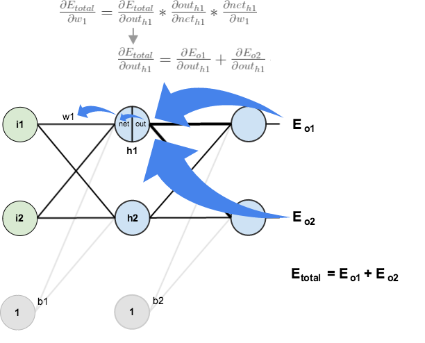

# A Step by Step Backpropagation Example

# 一步一步理解反向传播

> ##### 译序
>
> 由于人工智能在近年取得的巨大成功，在我的工作中需要涉及机器学习，以及人工智能的项目和产品需求越来越多。而合作的同事们未必都有很好的数学和计算机基础，为了未来工作中更好地沟通，我找来了这篇非常好的文章，以便大家能对机器学习，以及人工智能的实现方式有个简捷、直观的了解。
>
> 本来原文的英语就非常简洁，逻辑清晰，语义上并无翻译的必要。译文的意义在于记录我自己的一些体会，以及提示一些计算机与应用数学方面的概念和技巧，以便其他专业的朋友易于理解。译文也对原文进行了一些数学表述上修改，以便大家更容易去除理解上的混乱。
>
> 原著：[Matthew.H.Mazur](matthew.h.mazur@gmail.com)
>
> 编译：[罗峥嵘](vortune@163.com)

Backpropagation is a common method for training a neural network. There is [no shortage of papers](https://www.google.com/search?q=backpropagation+algorithm) online that attempt to explain how backpropagation works, but few that include an example with actual numbers. This post is my attempt to explain how it works with a concrete example that folks can compare their own calculations to in order to ensure they understand backpropagation correctly.

反向传播是训练神经网络的一种常用的方法。网上并不缺乏说明反向传播的工作机制的文章，只是它们都缺乏包含实际数值计算的例子。我的这个帖子就是希望以具体的范例，让大家可以从实际的计算中，正确理解反向传播算法。

If this kind of thing interests you, you should [sign up for my newsletter](http://www.emergentmind.com/newsletter) where I post about AI-related projects that I’m working on.

如果你对这些有兴趣，你可以登录[我的新闻组](http://www.emergentmind.com/newsletter)，那里有我发布的一些我正在做的人工智能相关的项目。

## Backpropagation in Python

You can play around with a Python script that I wrote that implements the backpropagation algorithm in [this Github repo](https://github.com/mattm/simple-neural-network).

## Overview

For this tutorial, we’re going to use a neural network with two inputs, two hidden neurons, two output neurons. Additionally, the hidden and output neurons will include a bias.

Here’s the basic structure:

In order to have some numbers to work with, here are the **initial weights**, the **biases**, and **training inputs/outputs**:

The goal of backpropagation is to optimize the weights so that the neural network can learn how to correctly map arbitrary inputs to outputs.

For the rest of this tutorial we’re going to work with a single training set: given inputs 0.05 and 0.10, we want the neural network to output 0.01 and 0.99.

## The Forward Pass

To begin, lets see what the neural network currently predicts given the weights and biases above and inputs of 0.05 and 0.10. To do this we’ll feed those inputs forward though the network.

We figure out the *total net input* to each hidden layer neuron, *squash* the total net input using an *activation function* (here we use the *logistic function*), then repeat the process with the output layer neurons.

> Total net input is also referred to as just net input by [some sources](http://web.cs.swarthmore.edu/~meeden/cs81/s10/BackPropDeriv.pdf).

Here’s how we calculate the total net input for $h_1$ :

$$
\begin{align}
net_{h1}  &=  w_1 \cdot i_1 + w_2 \cdot i_2 + b_1 \cdot 1 \\ \\
&= 0.15 * 0.05 + 0.2 * 0.1 + 0.35 * 1 \\ \\
&= 0.3775
\end{align}
$$

We then squash it using the logistic function to get the output of $h_1$ :

$$
\begin{align}
out_{h1} &= \frac{1}{1+e^{-net_{h1}}} \\ \\
&= \frac{1}{1+e^{-0.3775}} \\ \\
&= 0.593269992
\end{align}
$$

Carrying out the same process for $h_2$ we get:

$$
out_{h2} = 0.596884378
$$

We repeat this process for the output layer neurons, using the output from the hidden layer neurons as inputs.

Here’s the output for $o_1$:

$$
\begin{align}
net_{o1} &= w_5 \cdot out_{h1} + w_6 \cdot out_{h2} + b_2 \cdot 1 \\ \\
&= 0.4 * 0.593269992 + 0.45 * 0.596884378 + 0.6 * 1 \\ \\
&= 1.105905967 \\ \\
out_{o1} &= \frac{1}{1+e^{-net_{o1}}} \\ \\
&= \frac{1}{1+e^{-1.1059059067}} \\ \\
&= 0.75136507
\end{align}
$$

And carrying out the same process for $o_2$ we get:
$$
out_{o2} = 0.772928465
$$

### Calculating the Total Error

We can now calculate the error for each output neuron using the [squared error function](http://en.wikipedia.org/wiki/Backpropagation#Derivation) and sum them to get the total error:

$$
E_{total} = \sum \frac{1}{2}\|target - output\|^2
$$

> [Some sources](http://www.amazon.com/Introduction-Math-Neural-Networks-Heaton-ebook/dp/B00845UQL6/ref=sr_1_1?ie=UTF8&qid=1426296804&sr=8-1&keywords=neural+network) refer to the target as the *ideal* and the output as the *actual*.

> The $\frac{1}{2}$ is included so that exponent is cancelled when we differentiate later on. The result is eventually multiplied by a learning rate anyway so it doesn’t matter that we introduce a constant here [[1](http://en.wikipedia.org/wiki/Backpropagation#Derivation)].

For example, the target output for $o_1$ is 0.01 but the neural network output 0.75136507, therefore its error is:

$$
\begin{align}
E_{o1} &= \frac{1}{2}\|target_{o1}-out_{o1}\|^2 \\ \\
&=\frac{1}{2}\|0.01-0.75136507\|^2 \\ \\
&= 0.274811083
\end{align}
$$

Repeating this process for $o_2$ (remembering that the target is 0.99) we get:

$$
E_{o2} = 0.023560026
$$

The total error for the neural network is the sum of these errors:

$$
\begin{align}
E_{total} &= E_{o1} + E_{o2} \\ \\
&= 0.274811083 + 0.023560026 \\ \\
&= 0.298371109
\end{align}
$$

## The Backwards Pass

Our goal with backpropagation is to update each of the weights in the network so that they cause the actual output to be closer the target output, thereby minimizing the error for each output neuron and the network as a whole.

### Output Layer

Consider $w_5$. We want to know how much a change in $w_5$ affects the total error, aka $\frac{\partial E_{total}}{\partial w_5}$.

>$\frac{\partial E_{total}}{\partial w_5}$ is read as “the partial derivative of  $E_{total}$ with respect to $w_5$“. You can also say “the gradient with respect to $w_5$“.

By applying the [chain rule](http://en.wikipedia.org/wiki/Chain_rule) we know that:

$$
\frac{\partial E_{total}}{\partial w_5} =
\frac{\partial E_{total}}{\partial out_{o1}} \cdot 
\frac{\partial out_{o1}}{\partial net_{o1}} \cdot
\frac{\partial net_{o1}}{\partial w_5}
$$

Visually, here’s what we’re doing:

We need to figure out each piece in this equation.

First, how much does the total error change with respect to the output?

$$
\begin{align}
E_{total} &= \frac{1}{2}\|target_{o1}-out_{o1}\|^2 
+ \frac{1}{2}\|target_{o2}-out_{o2}\|^2 \\ \\
\frac {\partial E_{o1}}{\partial out_{o1}} &=
2 \cdot \frac {1}{2}\|target_{o1}-out_{o1}\|^{2-1} + 0 \\ \\
&= \|target_{o1}-out_{o1}\| \\ \\
&= \|0.01-0.75136507\| \\ \\
&= 0.74136507
\end{align}
$$

> $-(target - out)$ is sometimes expressed as $(out - target)$

> When we take the partial derivative of the total error with respect to $out_{o1}$, the quantity $\frac{1}{2}(target_{o2} - out_{o2})^{2}$ becomes zero because $out_{o1}$ does not affect it which means we’re taking the derivative of a constant which is zero.

Next, how much does the output of $o_1$ change with respect to its total net input?

The partial [derivative of the logistic function](http://en.wikipedia.org/wiki/Logistic_function#Derivative) is the output multiplied by 1 minus the output:

$$
\begin{align}
out_{o1} &= \frac {1}{1+e^{-net_{o1}}} \\ \\
\frac {\partial out_{o1}}{\partial net_{o1}} 
&= out_{o1}(1-out_{o1}) \\ \\
&= 0.75136507(1-0.75136507) \\ \\
&= 0.186815602
\end{align}
$$

Finally, how much does the total net input of $o1$ change with respect to $w_5$?

$$
\begin{align}
net_{o1} &= w_5 \cdot out_{h1} + w_6 \cdot out_{h2} + b_2 \cdot 1 \\ \\
\frac {\partial net_{o1}}{\partial w_5} &=
1 \cdot out_{h1} \cdot w_5^{(1-1)} + 0 + 0 \\ \\
&= out_{h1} \\ \\
&= 0.593269992
\end{align}
$$

Putting it all together:

$$
\begin{align}
\frac {\partial E_{total}}{\partial w5} &= 
\frac {\partial E_{total}}{\partial out_{h1}} \cdot
\frac {\partial out_{h1}}{\partial net_{h1}} \cdot
\frac {\partial net_{h1}}{\partial w_5} \\ \\
&= 0.036350306 * 0.241300709 * 0.05 \\ \\
&= 0.000433568
\end{align}
$$

> You’ll often see this calculation combined in the form of the [delta rule](http://en.wikipedia.org/wiki/Delta_rule):
>
> $$
> \frac {\partial E_{total}}{\partial w_5} =
> -(target_{o1}-out_{o1}) \cdot out_{o1}(1-out_{o1}) \cdot out_{h1}
> $$
>
> Alternatively, we have $\frac{\partial E_{total}}{\partial out_{o1}}$ and $\frac{\partial out_{o1}}{\partial net_{o1}}$ which can be written as $\frac{\partial E_{total}}{\partial net_{o1}}$, aka $\delta_{o1}$ (the Greek letter delta) aka the *node delta*. We can use this to rewrite the calculation above:
>
> $$
> \begin{align}
> \delta_{o1} &= \frac{\partial E_{total}}{\partial out_{o1}} \cdot
> \frac{\partial out_{o1}}{\partial net_{o1}} \\ \\
> &= \frac{\partial E_{total}}{\partial net_{o1}} \\ \\
> &= -(target_{o1}-out_{o1}) \cdot out_{o1}(1-out_{o1})
> \end{align}
> $$
>
> Therefore:
>
> $$
> \frac{\partial E_{total}}{\partial w_5} = \delta_{o1} \cdot out_{h1}
> $$
>
> Some sources extract the negative sign from $\delta$ so it would be written as:
>
> $$
> \frac{\partial E_{total}}{\partial w_5} = -\delta_{o1} \cdot out_{h1}
> $$
>

To decrease the error, we then subtract this value from the current weight (optionally multiplied by some learning rate, eta, which we'll set to 0.5):

$$
\begin{align}
w_5^+ &= w_5 - \eta \frac{\partial E_{total}}{\partial w_5} \\ \\
&= 0.4 - 0.5 * 0.082167041 \\ \\
&= 0.35891648
\end{align}
$$

[Some](http://en.wikipedia.org/wiki/Delta_rule) [sources](http://aima.cs.berkeley.edu/) use $\alpha$ (alpha) to represent the learning rate, [others use](https://www4.rgu.ac.uk/files/chapter3%20-%20bp.pdf) $\eta$ (eta), and [others](http://web.cs.swarthmore.edu/~meeden/cs81/s10/BackPropDeriv.pdf) even use $\epsilon$  (epsilon).

We can repeat this process to get the new weights $w_6$, $w_7$, and $w_8$:

$$
\begin{align}
w_6^{+} &= 0.408666186 \\ \\
w_7^{+} &= 0.511301270 \\ \\
w_8^{+} &= 0.561370121
\end{align}
$$

We perform the actual updates in the neural network after we have the new weights leading into the hidden layer neurons (ie, we use the original weights, not the updated weights, when we continue the backpropagation algorithm below).

### Hidden Layer

Next, we’ll continue the backwards pass by calculating new values for $w_1$, $w_2$, $w_3$, and $w_4$.

Big picture, here’s what we need to figure out:

$$
\frac{\partial E_{total}}{\partial w_1} = \frac{\partial E_{total}}{\partial out_{h1}} \cdot
\frac{\partial out_{h1}}{\partial net_{h1}} \cdot
\frac{\partial net_{h1}}{\partial w_1}
$$

Visually:

We’re going to use a similar process as we did for the output layer, but slightly different to account for the fact that the output of each hidden layer neuron contributes to the output (and therefore error) of multiple output neurons. We know that $out_{h1}$ affects both $out_{o1}$ and $out_{o2}$ therefore the $\frac{\partial E_{total}}{\partial out_{h1}}$ needs to take into consideration its effect on the both output neurons:

$$
\frac{\partial E_{total}}{\partial out_{h1}} = 
\frac{\partial E_{o1}}{\partial out_{h1}} + \frac{\partial E_{o2}}{\partial out_{h1}}
$$

Starting with $\frac{\partial E_{o1}}{\partial out_{h1}}$:

$$
\frac{\partial E_{o1}}{\partial out_{h1}} =
\frac{\partial E_{o1}}{\partial net_{o1}} \cdot \frac{\partial net_{o1}}{\partial out_{h1}}
$$

We can calculate $\frac{\partial E_{o1}}{\partial net_{o1}}$ using values we calculated earlier:

$$
\begin{align}
\frac{\partial E_{o1}}{\partial net_{o1}} &= 
\frac{\partial E_{o1}}{\partial out_{o1}} \cdot \frac{\partial out_{o1}}{\partial net_{o1}} \\ \\
&= 0.74136507 * 0.186815602 \\ \\
&= 0.138498562
\end{align}
$$

And $\frac{\partial net_{o1}}{\partial out_{h1}}$ is equal to $w_5$:

$$
net_{o1} = w_5 \cdot out_{h1} + w_6 \cdot out_{h2} + b_2 \cdot 1
$$
$$
\frac{\partial net_{o1}}{\partial out_{h1}} = w_5 = 0.40
$$

Plugging them in:

$$
\begin{align}
\frac{\partial E_{o1}}{\partial out_{h1}} &=
\frac{\partial E_{o1}}{\partial net_{o1}} \cdot \frac{\partial net_{o1}}{\partial out_{h1}} \\ \\
&= 0.138498562 * 0.40 \\ \\
&= 0.055399425
\end{align}
$$

Following the same process for $\frac{\partial E_{o2}}{\partial out_{h1}}$, we get:

$$
\frac {\partial E_{o2}}{\partial out_{h1}} = -0.01904919
$$

Therefore:

$$
\begin{align}
\frac {\partial E_{total}}{\partial out_{h1}} &=
\frac {\partial E_{o1}}{\partial out_{h1}} + \frac {\partial E_{o2}}{\partial out_{h1}} \\ \\
&= 0.055399425 + -0.019049119 \\ \\
&= 0.036350306
\end{align}
$$

Now that we have $\frac{\partial E_{total}}{\partial out_{h1}}$, we need to figure out $\frac{\partial out_{h1}}{\partial net_{h1}}$ and then $\frac{\partial net_{h1}}{\partial w}$ for each weight:

$$
out_{h1} = \frac {1}{1+e^{-net_{h1}}}
$$

$$
\begin{align}
\frac {\partial out_{h1}}{\partial net_{h1}} &= out_{h1}(1-out_{h1}) \\ \\
&= 0.59326999(1- 0.59326999) \\ \\
&= 0.241300709
\end{align}
$$

We calculate the partial derivative of the total net input to $h_1$ with respect to $w_1$ the same as we did for the output neuron:

$$
net_{h1} = w_1 \cdot i_1 + w_2 \cdot i_2 + b_1 \cdot 1
$$

$$
\begin{align}
\frac {\partial net_{h1}}{\partial w_1} &= i \\
&= 0.05
\end{align}
$$

Putting it all together:

$$
\begin{align}
\frac {\partial E_{total}}{\partial w_1} &=
\frac {\partial E_{total}}{\partial out_{h1}} \cdot 
\frac {\partial out_{h1}}{\partial net_{h1}} \cdot
\frac {\partial net_{h1}}{\partial w_1} \\ \\
&= 0.036350306 * 0.241300709 * 0.05 \\ \\
&= 0.000438568
\end{align}
$$

>You might also see this written as:
>
>$$
>\begin{align}
>\frac {\partial E_{total}}{\partial w_1} &=
>\biggl(
>\sum_o \frac {\partial E_{total}}{\partial out_o} \cdot
>\frac {\partial out_o}{\partial net_o} \cdot
>\frac {\partial net_o}{\partial out_{h1}}
>\biggr) \cdot
>\frac {\partial out_{h1}}{\partial net_{h1}} \cdot
>\frac {\partial net_{h1}}{\partial w_1} \\ \\
>&= \biggl(\sum_o \delta_o \cdot w_{ho}\biggr) \cdot
>out_{h1}\biggl(1-out_{h1}\biggr) \cdot i_1 \\ \\
>&= \delta_{h1}i_1
>\end{align}
>$$
>

We can now update $w_1$:

$$
\begin{align}
w_1^{+} &= w_1 - \eta \cdot \frac {\partial E_{total}}{\partial w_1} \\ \\
&= 0.15 - 0.15 * 0.000438568 \\ \\
&= 0.149780716
\end{align}
$$

Repeating this for $w_2$, $w_3$, and $w_4$

$$
w_2^{+} = 0.19956143 \\ \\
w_3^{+} = 0.24975114 \\ \\
w_4^{+} = 0.29950229 \\ \\
$$

Finally, we’ve updated all of our weights! When we fed forward the 0.05 and 0.1 inputs originally, the error on the network was 0.298371109. After this first round of backpropagation, the total error is now down to 0.291027924. It might not seem like much, but after repeating this process 10,000 times, for example, the error plummets to 0.000035085. At this point, when we feed forward 0.05 and 0.1, the two outputs neurons generate 0.015912196 (vs 0.01 target) and 0.984065734 (vs 0.99 target).

If you’ve made it this far and found any errors in any of the above or can think of any ways to make it clearer for future readers, don’t hesitate to [drop me a note](https://mattmazur.com/contact/). Thanks!